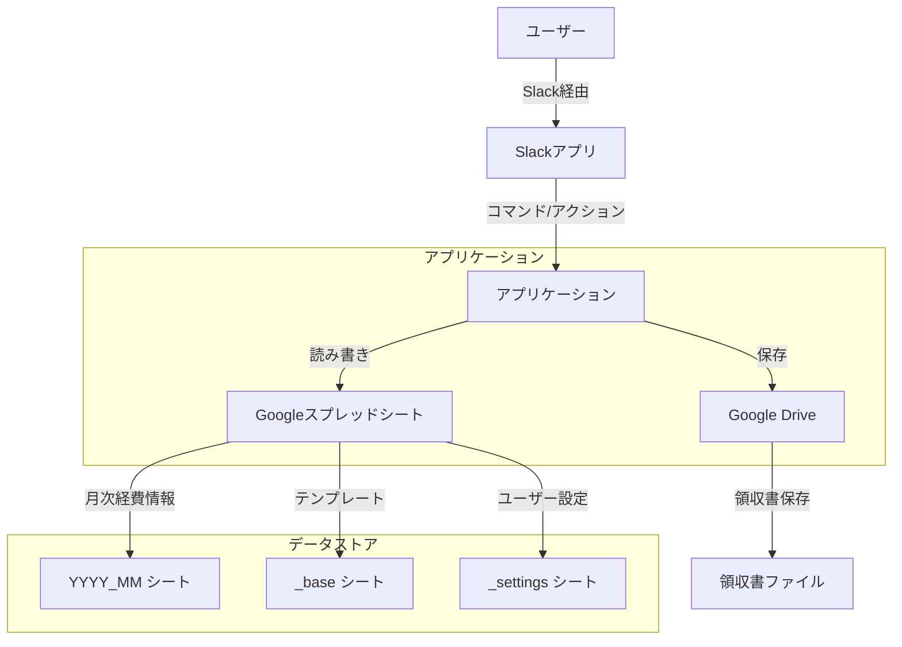
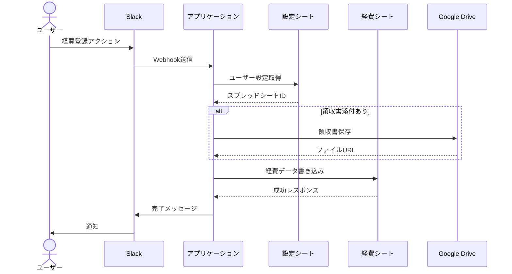

# アプリケーション構成図

## 1. システム全体像



## 2. ディレクトリ構造

```
slack2keihi/
├── docs/                         # ドキュメント
│   ├── app_structure.md             # アプリケーション構成図
│   ├── database_spec.md             # データベース仕様
│   ├── export_spec.md              # エクスポート仕様
│   ├── implementation_plan.md       # 実装計画
│   ├── keep-alive.md               # キープアライブ仕様
│   ├── service_spec.md             # サービス仕様
│   ├── spreadsheet_spec.md         # スプレッドシート仕様
│   └── troubleshooting.md          # トラブルシューティング
├── scripts/                      # スクリプト
│   ├── inspect-sheets.js           # シート検査
│   ├── keep-alive.gs              # キープアライブスクリプト
│   ├── setup-settings-sheet.js     # 設定シート作成
│   ├── setup-test-sheet.js        # テストシート作成
│   └── test-setup.js              # テスト環境セットアップ
├── src/                          # ソースコード
│   ├── config/                     # 設定
│   │   └── config.js                 # アプリ設定
│   ├── routes/                     # ルーティング
│   │   └── expense.js               # 経費処理ルート
│   ├── services/                   # サービス
│   │   ├── driveService.js          # Drive操作
│   │   ├── exportService.js         # エクスポート
│   │   ├── ocrService.js            # OCR処理
│   │   ├── pdfService.js            # PDF処理
│   │   ├── sessionService.js        # セッション管理
│   │   ├── settingsService.js       # 設定管理
│   │   ├── sheetsService.js         # スプレッドシート操作
│   │   └── slackService.js          # Slack連携
│   ├── utils/                      # ユーティリティ
│   │   ├── errors.js                # エラー定義
│   │   └── fileManager.js           # ファイル管理
│   └── index.js                    # エントリーポイント
├── test/                         # テスト
│   ├── data/                       # テストデータ
│   ├── test-drive-service.js       # Driveサービステスト
│   ├── test-errors.js             # エラーテスト
│   ├── test-export-service.js     # エクスポートテスト
│   ├── test-pdf-export.js         # PDFエクスポートテスト
│   ├── test-settings-service.js   # 設定サービステスト
│   ├── test-sheets-service.js     # シートサービステスト
│   └── setup.js                   # テスト共通設定
├── .env.example                  # 環境変数サンプル
├── .gitignore                    # Git除外設定
├── .nvmrc                        # Node.jsバージョン
├── jest.config.js               # Jestテスト設定
├── manifest.yml                 # アプリケーション設定
├── package.json                 # パッケージ設定
├── README.md                    # プロジェクト説明
└── start.sh                     # 起動スクリプト
```

## 3. データフロー



## 4. コンポーネント関係

```mermaid
graph LR
    subgraph "ルーティング"
        ExpenseRoute[expense.js]
    end

    subgraph "サービス層"
        SlackService[slackService.js]
        SheetsService[sheetsService.js]
        DriveService[driveService.js]
        ExportService[exportService.js]
        SessionService[sessionService.js]
        SettingsService[settingsService.js]
        OCRService[ocrService.js]
        PDFService[pdfService.js]
    end

    subgraph "ユーティリティ"
        Errors[errors.js]
        FileManager[fileManager.js]
    end

    ExpenseRoute --> SlackService
    ExpenseRoute --> SheetsService
    ExpenseRoute --> DriveService
    
    SheetsService --> SettingsService
    DriveService --> FileManager
    ExportService --> SheetsService
    
    SlackService --> SessionService
    OCRService --> FileManager
    PDFService --> FileManager
    
    SheetsService --> Errors
    DriveService --> Errors
    SlackService --> Errors